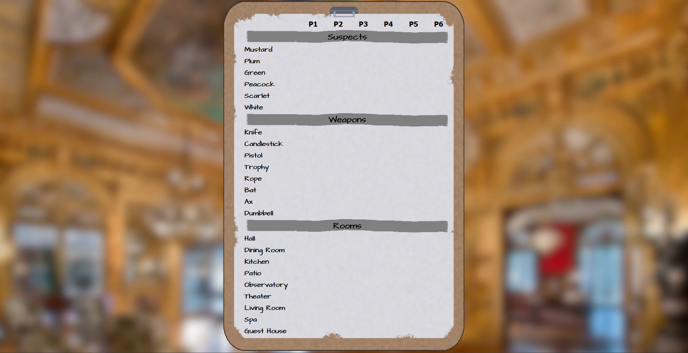
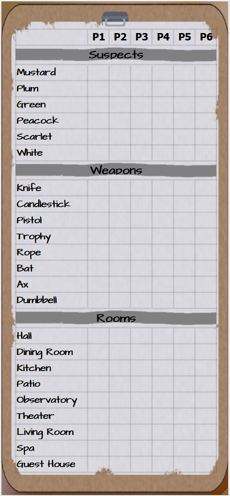

# Clue Tracking Sheet

Tracking sheet for the board game Clue. The design is based of the tracking sheet from the Clue video game. 
This repo is automatically deployed [here](https://cluesheet.markforte.dev) using GitHub Actions

## Screenshots

*Screenshot of the desktop version of the site*

 
*Screenshot of the mobile version of the site*

## Current features

- [x] Basic desktop and mobile site
  - Some device specific features like highlighting and table borders
- [x] Text inputs for each card for note-taking
- [x] Users can rename players

## Planned Features

- [ ] Save data over refresh and add new game button
- [ ] Improve Mobile Site
- [ ] Add player count selector
- [ ] Player icons
- [ ] Ability to cross off entire player
- [ ] Add option to cross out / circle cards
- [ ] Replace text inputs with icon selector like in video game
- [ ] Hint tool